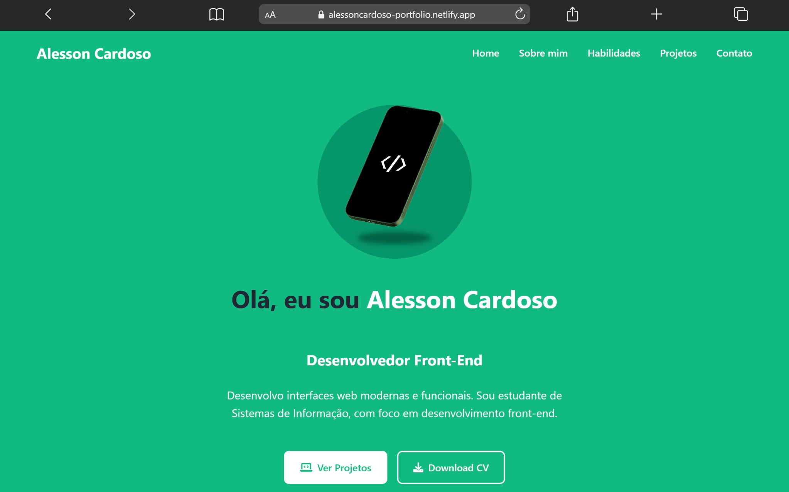
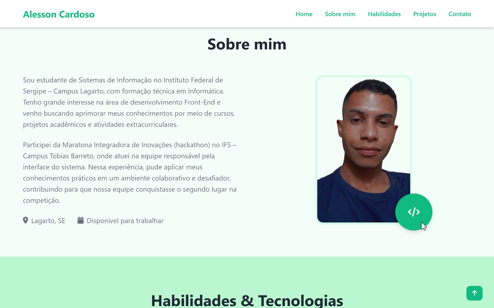
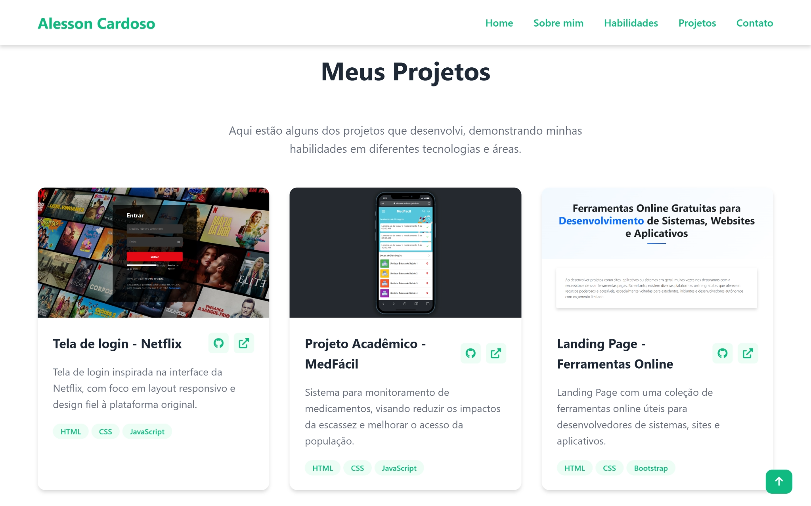

# Portfólio Web

> Portfólio pessoal moderno e responsivo desenvolvido para apresentar projetos, habilidades, experiências e informações profissionais de forma elegante e intuitiva.

---

# 📖 Sobre o Projeto

O **Portfólio Web** foi desenvolvido com o objetivo de criar uma presença profissional online, reunindo projetos acadêmicos, estudos e experiências em desenvolvimento Front-End.

A aplicação possui uma interface moderna, responsiva e organizada, permitindo apresentar tecnologias dominadas, projetos desenvolvidos e formas de contato em um único ambiente digital.

O projeto também serve como espaço de evolução contínua, onde novos projetos, funcionalidades e melhorias podem ser adicionados futuramente.

---

# ✨ Funcionalidades

## 👨‍💻 Apresentação Profissional

* Introdução pessoal
* Descrição profissional
* Links para redes sociais
* Download de currículo

## 📚 Sobre Mim

* Informações acadêmicas
* Experiências em hackathons
* Objetivos profissionais
* Disponibilidade para trabalho

## 🚀 Habilidades & Tecnologias

* Exibição das principais tecnologias utilizadas
* Tags organizadas por habilidades
* Tecnologias Front-End e Back-End

## 📂 Projetos

* Cards interativos de projetos
* Imagens ilustrativas
* Descrição detalhada
* Tecnologias utilizadas
* Links para GitHub
* Links externos para demonstrações

## 📞 Contato

* Integração com GitHub
* Integração com LinkedIn
* Contato via e-mail

## 📱 Interface

* Layout totalmente responsivo
* Navegação suave entre seções
* Menu mobile responsivo
* Botão de voltar ao topo
* Design moderno e minimalista
* Ícones utilizando Font Awesome

---

# 🚀 Tecnologias Utilizadas

* HTML5
* CSS3
* JavaScript
* Font Awesome

---

# 🧠 Conceitos Aplicados

* Estruturação semântica com HTML
* Responsividade com CSS
* Manipulação de DOM
* Navegação SPA simples
* Organização modular de componentes
* Scroll suave entre seções
* Layout Flexbox e Grid
* Design responsivo
* Boas práticas de UI/UX

---

# 📂 Estrutura do Projeto

```bash id="0dk92f"
portfolio-web/
│
├── index.html
├── css/
│   └── style.css
├── js/
│   └── script.js
├── images/
│   ├── profile/
│   ├── previews/
│   ├── projects/
│   └── mockups/
└── README.md
```

---

# ⚙️ Funcionalidades do Sistema

## 🧭 Navegação

* Menu fixo responsivo
* Navegação entre seções
* Menu hambúrguer para mobile

## 🎨 Interface Responsiva

O projeto adapta automaticamente os elementos para:

* Desktop
* Tablets
* Smartphones

## 🔝 Scroll To Top

* Botão flutuante para retorno rápido ao topo da página

---

# 🖼️ Preview

### Página Inicial



### Sobre Mim



### Projetos



---

# 💼 Projetos Apresentados

## 🎬 Tela de Login — Netflix

Clone da tela de login da Netflix com foco em fidelidade visual e responsividade.

## 💊 MedFácil

Sistema acadêmico para monitoramento de medicamentos e auxílio no acesso da população.

## 🛠️ Ferramentas Online

Landing page com ferramentas úteis para desenvolvedores de sistemas, sites e aplicativos.

## 🌐 Portfólio Web

Projeto do próprio portfólio pessoal desenvolvido com foco em design moderno e responsividade.

---

# 🛠️ Como Executar o Projeto

Clone o repositório:

```bash id="3p3xq0"
git clone https://github.com/alessoncardoso/portfolio-web.git
```

Acesse a pasta:

```bash id="5s8l4d"
cd portfolio-web
```

Abra o arquivo `index.html` no navegador.

---

# 📌 Status do Projeto

```txt id="f7w3kc"
🚧 Em desenvolvimento
```

---

# 🎯 Objetivo do Projeto

O objetivo do Portfólio Web é funcionar como uma plataforma profissional para:

* Apresentar projetos e experiências
* Demonstrar habilidades técnicas
* Compartilhar evolução profissional
* Facilitar networking
* Centralizar informações profissionais
* Servir como currículo online

---

# 📄 Licença

Este projeto foi desenvolvido para fins de estudo, aprendizado e evolução profissional.

---

# 👨‍💻 Autor

Desenvolvido por **Alesson Cardoso**.

* GitHub:
  [github.com/alessoncardoso](https://github.com/alessoncardoso?utm_source=chatgpt.com)

* LinkedIn:
  [linkedin.com/in/alessoncardoso](https://www.linkedin.com/in/alessoncardoso?utm_source=chatgpt.com)
